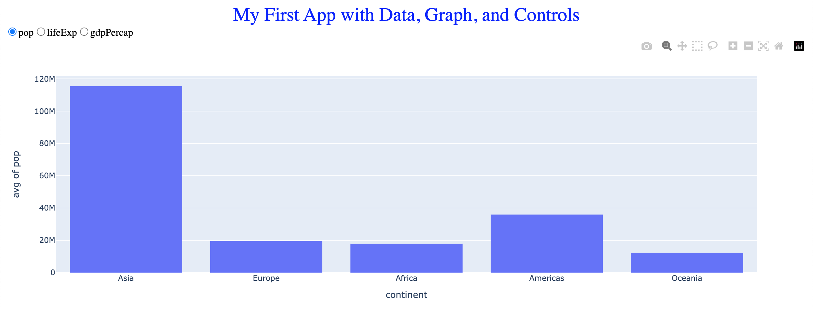
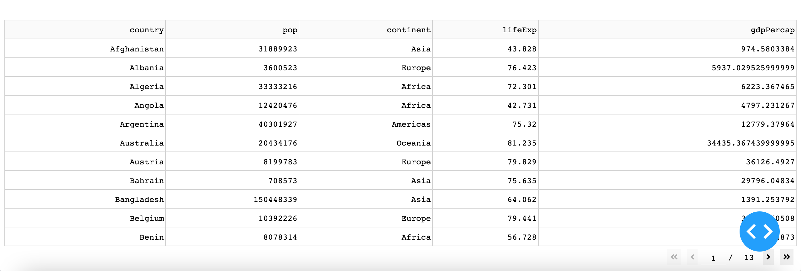

# plotly_dash_practice

Learning Dash

Created a single web page app that renders a graph from the data read from a csv file.

Offers some interaction by allowing users to view up to three different graphs. Can select options: pop, life exp, gdp percap:

Utilized resource - [Dash](https://dash.plotly.com/tutorial)
